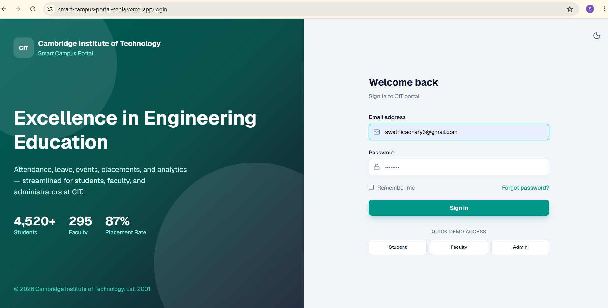
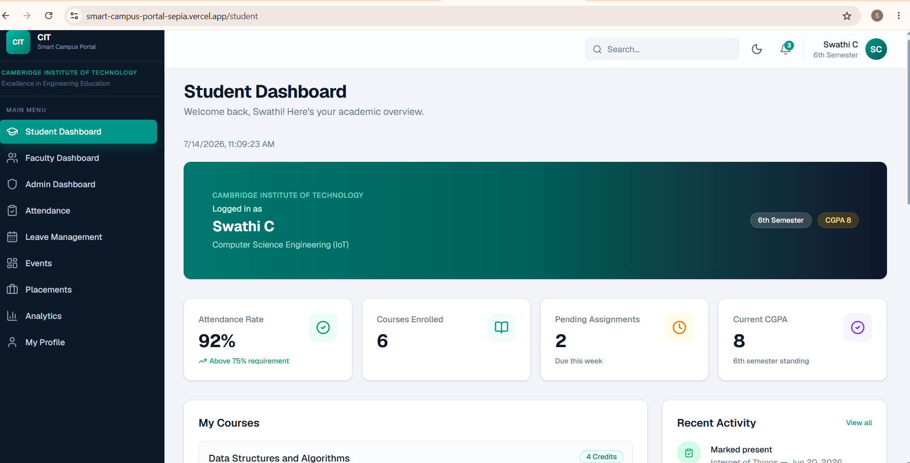
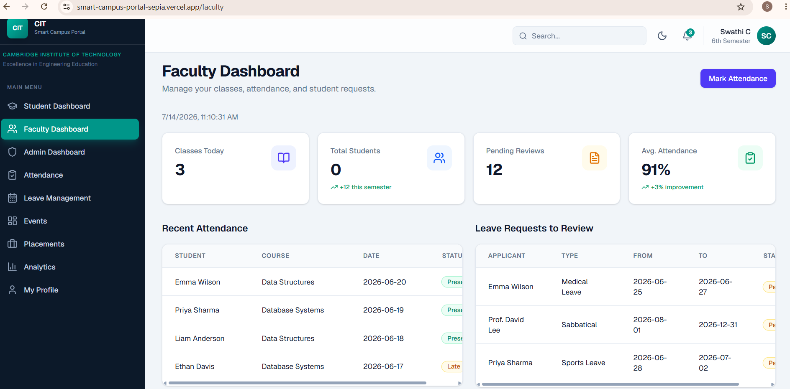
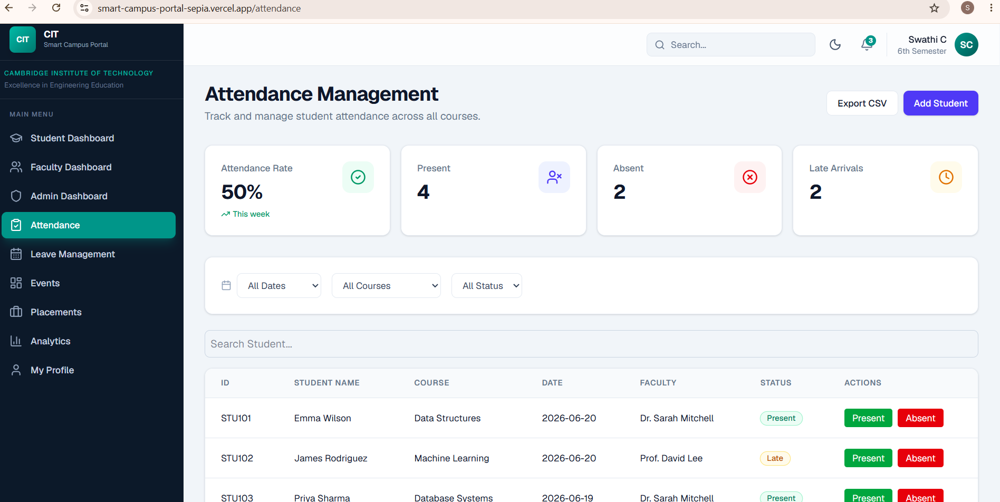
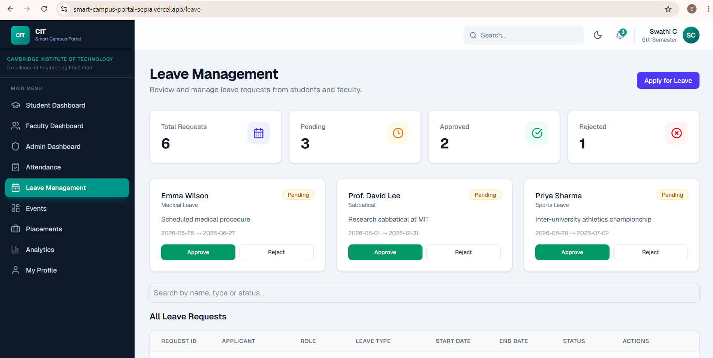
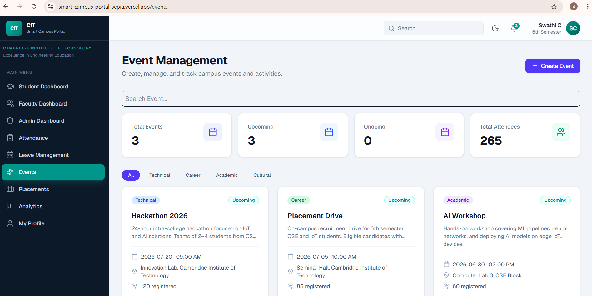
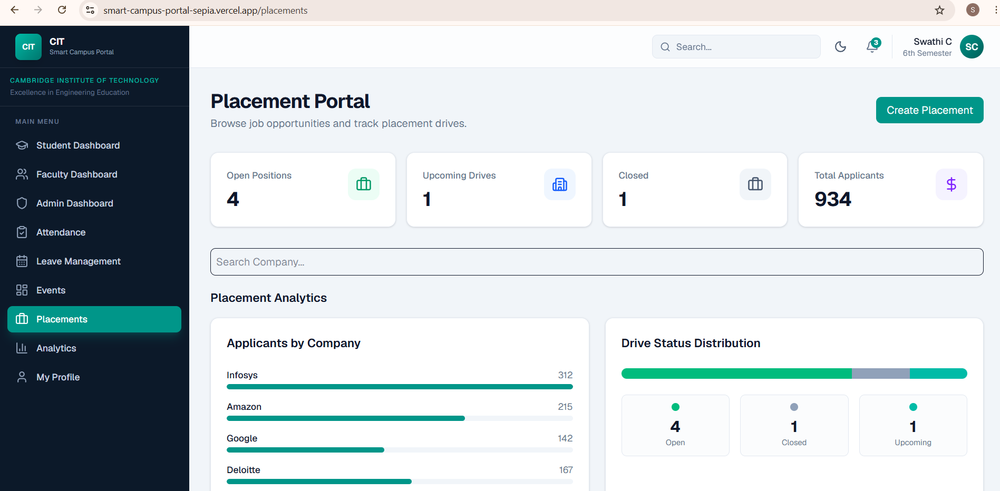

# 🎓 Smart Campus Management Portal

A modern **Smart Campus Management Portal** developed using **Next.js**, **React.js**, **TypeScript**, and **Tailwind CSS** to simplify campus administration through a centralized dashboard.

---

## 🚀 Live Demo

🌐 **Website:** https://smart-campus-portal-sepia.vercel.app

---

## 📂 GitHub Repository

🔗 https://github.com/Swathi200301/smart-campus-portal

---

# 📖 Overview

The Smart Campus Management Portal is a web-based application that streamlines campus administration by providing dedicated dashboards and management modules for students, faculty, and administrators.

The system enables users to manage attendance, leave requests, events, placements, analytics, and academic activities through a single platform.

---

# ✨ Features

## 👨‍🎓 Student Module

- Student Dashboard
- Attendance Tracking
- Leave Application
- Placement Opportunities
- Event Registration
- Academic Analytics
- Student Profile

---

## 👨‍🏫 Faculty Module

- Faculty Dashboard
- Attendance Management
- Leave Approval
- Student Monitoring
- Event Management

---

## 👨‍💼 Admin Module

- Admin Dashboard
- Student Management
- Faculty Management
- Attendance Monitoring
- Leave Management
- Placement Portal
- Event Management
- Analytics Dashboard

---

# 🛠 Tech Stack

### Frontend

- Next.js
- React.js
- TypeScript
- Tailwind CSS

### Backend

- Local Storage (Demo Data)

### Development Tools

- Cursor IDE
- Git
- GitHub
- Vercel

---

# 📸 Screenshots

## 🔐 Login Page

<p align="center">

</p>

---

## 🎓 Student Dashboard

<p align="center">

</p>

---

## 👨‍🏫 Faculty Dashboard

<p align="center">

</p>

---

## 📅 Attendance Management

<p align="center">

</p>

---

## 📝 Leave Management

<p align="center">

</p>

---

## 🎉 Event Management

<p align="center">

</p>

---

## 💼 Placement Portal

<p align="center">

</p>

---

## 📊 Analytics Dashboard

<p align="center">

</p>

---

# 📂 Project Structure

```
smart-campus/
│
├── app/
├── components/
├── lib/
├── public/
├── screenshots/
├── types/
├── README.md
├── package.json
└── next.config.ts
```

---

# ⚙️ Installation

Clone the repository

```bash
git clone https://github.com/Swathi200301/smart-campus-portal.git
```

Navigate into the project

```bash
cd smart-campus-portal
```

Install dependencies

```bash
npm install
```

Run the development server

```bash
npm run dev
```

Open

```
http://localhost:3000
```

---

# 📈 Modules Included

✅ Login Authentication UI

✅ Student Dashboard

✅ Faculty Dashboard

✅ Admin Dashboard

✅ Attendance Management

✅ Leave Management

✅ Event Management

✅ Placement Portal

✅ Analytics Dashboard

---

# 🎯 Future Enhancements

- Firebase Authentication
- MySQL Database Integration
- Email Notifications
- Role-Based Access Control
- Cloud Storage
- Student Result Management
- Fee Management
- AI-powered Student Analytics
- Mobile Responsive Improvements

---

# 📊 Project Highlights

- Responsive User Interface
- Role-Based Dashboards
- Modern UI Design
- TypeScript Support
- Reusable React Components
- Search & Filter Functionality
- Interactive Analytics
- Deployment on Vercel
- Version Controlled using Git & GitHub

---

# 👩‍💻 Developed By

**Swathi C**

B.E. Computer Science Engineering (IoT)

Cambridge Institute of Technology


🔗 GitHub: https://github.com/Swathi200301

🌐 Live Demo: https://smart-campus-portal-sepia.vercel.app


